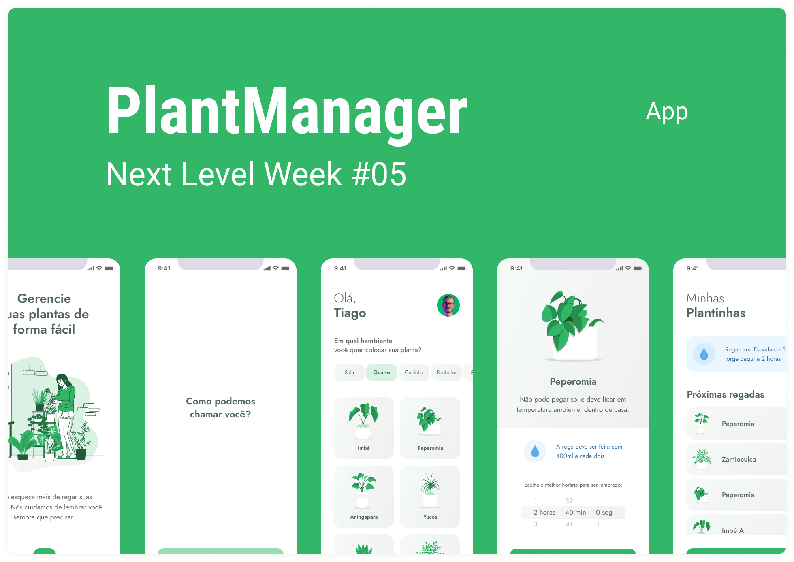

<h1 align="center">
  
</h1>

  

 

 

  

## ✨ Technologies

This project was developed by using the following technologies:

- [React Native](https://reactnative.dev/)
- [Typescript](https://www.typescriptlang.org/)
- [Expo](https://expo.io/)

## 💻 Project

Mobile app to help you remember to water your plants in an easy way, based on each plant type.

## 🔖 Layout

You can check the layout for this project through [this link](https://www.figma.com/file/IhQRtrOZdu3TrvkPYREzOy/PlantManager/duplicate). However, a [Figma](http://figma.com/) account is required to access it.

## 🚀 Getting started

- Clone this repo
- Install dependencies by running `yarn`
- Start the project with `expo start`
- On package.json and src/services/api.ts, change the IP address to your current network IP.
- Start the fake api by running `yarn dev:server`

## 📄 License

This project is under MIT license. See [LICENSE](LICENSE.md) for more details.

---

Made with ♥ by Rocketseat and recoded by me 👋🏻